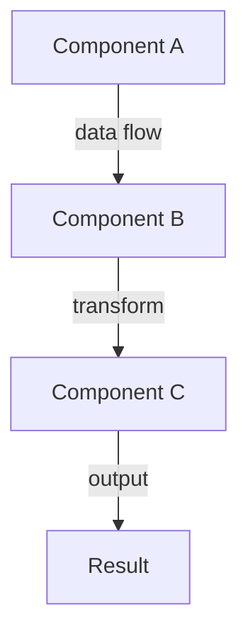
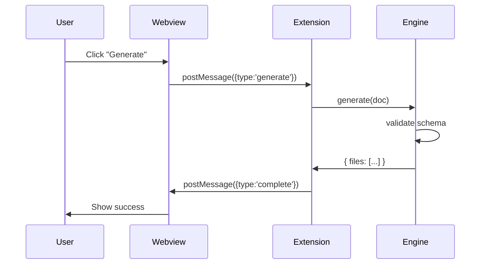

# Feature Plan: [Feature Name]

**Author**: @darianrosebrook  
**Date**: [YYYY-MM-DD]  
**Spec**: [DESIGNER-XXX]  
**Risk Tier**: [1|2|3]

---

## 1. Design Sketch

### Overview

[High-level description of what this feature accomplishes]

### Architecture Diagram



### API Changes

| Module | Method/Function | Input | Output | Notes |
|--------|----------------|-------|--------|-------|
| canvas-engine | `transformNode()` | `Node, Transform` | `Node` | Immutable transform |
| codegen-react | `emitComponent()` | `Node` | `string` | Deterministic output |

### Sequence Diagram



---

## 2. Test Matrix

### Unit Tests

| Test ID | Description | Input | Expected Output | Edge Cases |
|---------|-------------|-------|-----------------|------------|
| U1 | Schema validation | Valid canvas doc | Pass | Invalid ULIDs, missing fields |
| U2 | Node transformation | Frame node + translate | Transformed frame | Negative values, overflow |
| U3 | Code generation | Text node | React component | Special chars, empty text |

### Property-Based Tests

```typescript
// Example property test
fc.assert(
  fc.property(
    arbitraryCanvasDoc(),
    (doc) => {
      // Property: Schema validation is idempotent
      const validated1 = validateSchema(doc);
      const validated2 = validateSchema(validated1);
      return deepEqual(validated1, validated2);
    }
  )
);
```

**Properties to Test:**
- Determinism: `generate(doc) === generate(doc)`
- Idempotency: `transform(transform(x)) === transform(x)`
- Commutativity: `merge(a, b) === merge(b, a)` (where applicable)
- Stability: Node IDs never change across operations

### Integration Tests

| Test ID | Description | Setup | Action | Assertion |
|---------|-------------|-------|--------|-----------|
| I1 | Full codegen pipeline | Load canvas.json | Run generate | Output matches golden frame |
| I2 | Token reflection | Update tokens.json | Trigger watcher | CSS vars update in <16ms |
| I3 | Webview rendering | Load extension | Open designer | Canvas renders all nodes |

### E2E/Golden Frame Tests

| Golden Frame | Description | Input | Expected Output |
|--------------|-------------|-------|-----------------|
| home-hero | Basic frame with text | `tests/golden/home-hero.canvas.json` | `home-hero.tsx.expected` |
| token-binding | Token references | `tests/golden/token-binding.canvas.json` | CSS vars in output |

---

## 3. Data Plan

### Fixtures

```typescript
// Example fixture
const FIXTURE_CANVAS_DOC: CanvasDocument = {
  schemaVersion: '0.1.0',
  id: '01JF2PZV9G2WR5C3W7P0YHNX9D',
  name: 'Test Document',
  artboards: [
    {
      id: '01JF2Q02Q3MZ3Q9J7HB3X6N9QB',
      name: 'Artboard 1',
      frame: { x: 0, y: 0, width: 1440, height: 1024 },
      children: []
    }
  ]
};
```

### Factories

```typescript
// Factory for generating test data
export const createTextNode = (overrides?: Partial<TextNode>): TextNode => ({
  id: ulid(),
  type: 'text',
  name: 'Text',
  visible: true,
  frame: { x: 0, y: 0, width: 100, height: 20 },
  style: {},
  text: 'Test text',
  ...overrides
});
```

### Seed Strategy

- **Deterministic IDs**: Use fixed ULID seeds for reproducible tests
- **Token Values**: Use test token set with known values
- **Sample Designs**: Maintain 5-10 representative canvas documents

### Anonymized Payloads

```json
{
  "schemaVersion": "0.1.0",
  "id": "01TEST00000000000000000000",
  "name": "Test Document",
  "artboards": []
}
```

---

## 4. Observability Plan

### Logging Strategy

**Log Levels:**
- `ERROR`: Schema validation failures, codegen errors, extension crashes
- `WARN`: Token drift, performance budget violations, deprecated APIs
- `INFO`: Canvas load success, codegen completion, token updates
- `DEBUG`: Detailed rendering steps, node transformations

**Log Format:**
```typescript
{
  timestamp: '2025-10-02T12:34:56.789Z',
  level: 'INFO',
  category: 'canvas.load',
  status: 'success',
  metadata: {
    documentId: '01JF2PZV9G2WR5C3W7P0YHNX9D',
    nodeCount: 42,
    loadTimeMs: 15
  }
}
```

### Metrics

| Metric Name | Type | Description | Labels |
|-------------|------|-------------|--------|
| `canvas_nodes_total` | Gauge | Total nodes in document | `{document_id}` |
| `codegen_duration_ms` | Histogram | Time to generate code | `{template_type}` |
| `tokens_watch_updates_total` | Counter | Token file updates | `{token_category}` |
| `extension_activation_duration_ms` | Histogram | Extension activation time | `{vscode_version}` |

### Traces

**Spans to Instrument:**
1. `canvas.render.pipeline`
   - `canvas.load` (read file, parse JSON)
   - `canvas.validate` (schema validation)
   - `canvas.render` (webview paint)

2. `codegen.transform`
   - `codegen.parse` (load canvas doc)
   - `codegen.emit` (generate React)
   - `codegen.write` (save files)

3. `tokens.watch.flow`
   - `tokens.detect_change` (file watcher)
   - `tokens.parse` (load tokens)
   - `tokens.emit_css` (generate CSS vars)

### Verification in Tests

```typescript
// Assert on observability in tests
test('canvas load emits metrics', () => {
  const metrics = mockMetrics.getAll();
  
  expect(metrics).toContainEqual({
    name: 'canvas_nodes_total',
    value: 42,
    labels: { document_id: 'test-doc' }
  });
});
```

---

## 5. Implementation Phases

### Phase 1: Schema & Validation (Tier 1)

**Duration**: 2-3 days  
**Focus**: Define and validate data structures

**Tasks:**
- [ ] Define/update JSON Schema
- [ ] Generate TypeScript types with Zod
- [ ] Add schema validation tests
- [ ] Property-based tests for invariants

**Acceptance**: All schemas validate, types generate correctly

### Phase 2: Core Logic (Tier 1/2)

**Duration**: 3-5 days  
**Focus**: Implement business logic

**Tasks:**
- [ ] Implement core algorithms
- [ ] Add unit tests (target coverage)
- [ ] Add integration tests
- [ ] Performance profiling

**Acceptance**: All tests pass, performance budgets met

### Phase 3: Integration (Tier 2)

**Duration**: 2-3 days  
**Focus**: Wire up with existing systems

**Tasks:**
- [ ] Integrate with VS Code extension
- [ ] Update webview renderer
- [ ] Add E2E tests
- [ ] Golden frame validation

**Acceptance**: Feature works end-to-end in extension

### Phase 4: Polish & Documentation (Tier 3)

**Duration**: 1-2 days  
**Focus**: Documentation and examples

**Tasks:**
- [ ] Update README
- [ ] Add usage examples
- [ ] Update changelog
- [ ] Create migration guide (if needed)

**Acceptance**: Documentation complete, examples work

---

## 6. Risks & Mitigations

| Risk | Impact | Probability | Mitigation |
|------|--------|-------------|------------|
| Non-deterministic generation | High | Medium | Snapshot tests with hash comparison |
| Performance regression | Medium | Low | Performance budgets in CI |
| Token drift | Medium | Medium | Round-trip validation tests |
| Merge conflicts | Medium | High | Canonical JSON format, semantic diff tool |

---

## 7. Dependencies

### Upstream Dependencies
- [Feature/Module X] must be complete before starting
- [Schema Version Y] must be finalized

### Downstream Impact
- [Feature Z] will need updates to work with this
- [Documentation W] will need refresh

---

## 8. Success Criteria

### Functional
- [ ] All acceptance tests pass
- [ ] Golden frame tests match expected output
- [ ] Determinism verified across machines

### Non-Functional
- [ ] Performance budgets met
- [ ] Accessibility audit passes
- [ ] Security scan clean
- [ ] Documentation complete

### Quality
- [ ] Mutation score meets tier threshold
- [ ] Branch coverage meets tier threshold
- [ ] Contract tests pass
- [ ] No regressions in existing tests

---

## 9. Follow-Up Work

**Not in Scope for This Feature:**
- [Related feature that could come later]
- [Enhancement that would be nice to have]
- [Optimization that can wait]

**Technical Debt Created:**
- [Known limitation or hack that needs addressing]
- [Test coverage gap that's acceptable for now]

---

## 10. Questions & Decisions

| Question | Decision | Rationale | Date |
|----------|----------|-----------|------|
| Use JSON Patch or full-doc updates? | JSON Patch | Better performance for large docs | 2025-10-02 |
| Support YAML for tokens? | No, JSON only | Simpler parsing, better tooling | 2025-10-02 |

---

**Last Updated**: [Date]  
**Status**: [Planning|In Progress|Complete|Blocked]

