# Outstanding TODOs - Designer Project

**Date**: October 3, 2025  
**Author**: @darianrosebrook  
**Status**: Current as of DESIGNER-005 completion

---

## 🎯 Current TODO Tracking Status

### ✅ All DESIGNER-005 Tasks Complete

All tracked todos for the canvas-renderer-dom implementation are complete:
- ✅ Core build and rendering
- ✅ Performance optimization
- ✅ Accessibility features
- ✅ Observability infrastructure
- ✅ Comprehensive testing (94 tests)
- ✅ Merged to main

---

## 📝 Code-Level TODOs

### High Priority (Blocking Features)

**1. Properties Panel - VS Code Extension** (3 TODOs)
- **File**: `packages/vscode-ext/src/index.ts:262`
  ```typescript
  // TODO: Apply the property change to the document
  ```
  - Impact: Property editing doesn't persist to document
  - Effort: 1-2 days
  - Blocker for: Property panel functionality

**2. Properties Panel Webview** (5 TODOs)
- **File**: `packages/vscode-ext/src/properties-panel-webview.ts`
  - Line 205: `// TODO: In a full implementation, this would notify the canvas renderer`
  - Line 682: `// TODO: Update properties panel with document context`
  - Line 769: `// TODO: Get actual node ID`
  - Line 771: `// TODO: Track old values`
  - Line 786: `// TODO: Update UI to reflect the change was applied`
  - Line 791: `// TODO: Update property editors to reflect the new values`
  - Impact: Properties panel is not fully functional
  - Effort: 3-4 days
  - Blocker for: Interactive property editing

### Medium Priority (Feature Enhancements)

**3. Component Indexer - Compound Components** (2 TODOs)
- **File**: `packages/component-indexer/src/scanner.ts:196`
  ```typescript
  // TODO: Implement compound component detection
  ```
- **File**: `packages/component-indexer/src/scanner.js:151`
  - Impact: Can't detect compound components (e.g., `Select.Option`, `Tabs.Panel`)
  - Effort: 2-3 days
  - Blocker for: Advanced component patterns

**4. Canvas Renderer - Layout Systems** (2 TODOs)
- **File**: `packages/canvas-renderer-dom/src/renderers/frame.ts`
  - Line 171: `// TODO: Implement flexbox layout`
  - Line 177: `// TODO: Implement grid layout`
  - Impact: Limited layout capabilities (only basic positioning)
  - Effort: 3-5 days
  - Blocker for: Advanced layouts

**5. Canvas Renderer - Advanced Styling** (2 TODOs)
- **File**: `packages/canvas-renderer-dom/src/renderers/frame.ts:97`
  ```typescript
  // TODO: Support gradients, images in future
  ```
- **File**: `packages/canvas-renderer-dom/src/renderers/text.ts:136`
  ```typescript
  // TODO: Handle gradient text (background-clip: text)
  ```
  - Impact: No gradient support
  - Effort: 2-3 days
  - Blocker for: Advanced visual effects

### Low Priority (Nice-to-Have)

**6. CAWS Legacy Assessment** (1 TODO)
- **File**: `apps/tools/caws/legacy-assessment.ts:216`
  ```typescript
  // Placeholder: return based on number of files as proxy
  ```
  - Impact: Legacy code assessment not fully implemented
  - Effort: 1 day
  - Blocker for: None (internal tooling)

---

## 🔬 Research Questions (From GAPS_AND_UNKNOWNS.md)

### 🔴 P0 - Blocking (Mostly Complete ✅)

| ID | Title | Status | Notes |
|----|-------|--------|-------|
| RQ-001 | Clock injection pattern | ✅ Complete | Implemented in codegen-react |
| RQ-002 | Canonical string sorting | ✅ Complete | Implemented in codegen-react |
| RQ-003 | Floating point precision | ✅ Complete | Implemented in codegen-react |
| RQ-004 | Conflict taxonomy | ✅ Complete | Implemented in canvas-engine |
| RQ-005 | Semantic diff algorithm | ✅ Complete | Implemented in canvas-engine |
| RQ-006 | CRDT vs custom merge | ✅ Complete | Hybrid approach implemented |

### 🟠 P1 - Critical (Partially Complete)

| ID | Title | Status | Notes |
|----|-------|--------|-------|
| RQ-007 | Secure message protocol | ✅ Complete | Implemented in vscode-ext |
| RQ-008 | Path validation | ✅ Complete | Implemented in vscode-ext |
| RQ-009 | Resource limits | ✅ Complete | Implemented in vscode-ext |
| RQ-010 | Component discovery | ⏳ **Partial** | Scanner exists, compound detection missing |
| RQ-011 | Prop extraction | ⏳ **Partial** | Basic extraction works, needs enhancement |
| RQ-012 | Component index format | ⏳ **Partial** | Format defined, versioning incomplete |
| RQ-028 | Accessible canvas interaction | ✅ Complete | Full implementation in canvas-renderer-dom |
| RQ-029 | Contrast computation | ⏳ **Not Started** | Needed for a11y linting |
| RQ-030 | A11y linting for generated code | ⏳ **Not Started** | Needed for codegen validation |

### 🟡 P2 - Important (Mostly Not Started)

| ID | Title | Status | Priority |
|----|-------|--------|----------|
| RQ-013 | Token transformation algorithm | ⏳ Not Started | Medium |
| RQ-014 | Token reference resolution | ⏳ Not Started | Medium |
| RQ-015 | Token versioning | ⏳ Not Started | Medium |
| RQ-016 | High-performance canvas renderer | ✅ Complete | DOM approach chosen |
| RQ-017 | Efficient hit testing | ⏳ Partial | Basic, no R-tree |
| RQ-018 | Document size limits | ✅ Complete | 500 nodes tested |
| RQ-019 | SVG feature support matrix | ⏳ Not Started | Low |
| RQ-020 | SVG to VectorNode conversion | ⏳ Not Started | Low |
| RQ-021 | Smart token matching | ⏳ Not Started | Low |

### 🔵 P3 - Nice-to-Have (Deferred)

| ID | Title | Status | Notes |
|----|-------|--------|-------|
| RQ-022 | Property-based test strategy | ⏳ Not Started | Can use existing patterns |
| RQ-023 | Golden frame workflow | ✅ Partial | Snapshots implemented |
| RQ-024 | Visual regression testing tools | ⏳ Not Started | Deferred |
| RQ-025 | Cursor MCP protocol spec | ⏳ Not Started | Future feature |
| RQ-026 | MCP server architecture | ⏳ Not Started | Future feature |
| RQ-027 | MCP security model | ⏳ Not Started | Future feature |

---

## 📊 By Implementation Area

### Area 001: Deterministic Codegen - 75% Complete ✅

**Remaining**:
- [ ] Cross-platform CI testing (macOS, Linux, Windows)
- [ ] Performance benchmarks for all patterns
- [ ] Edge case testing for extreme values
- [ ] `docs/determinism.md` comprehensive guide

**Estimate**: 2-3 days

---

### Area 002: Merge Conflicts - 100% Complete ✅

**Status**: All research and implementation complete  
**Remaining**: None ✅

---

### Area 003: Extension Security - 90% Complete ✅

**Remaining**:
- [ ] Integration tests with real VS Code context
- [ ] CSP policy implementation for webview
- [ ] Security audit documentation (`docs/security.md`)
- [ ] Performance benchmarks for large documents

**Estimate**: 3-4 days

---

### Area 004: Component Discovery - 5% Complete ⏳

**Remaining**:
- [ ] Compound component detection (marked TODO in code)
- [ ] Monorepo component library support
- [ ] Third-party library integration
- [ ] Component versioning strategy
- [ ] Documentation in `docs/component-discovery.md`

**Estimate**: 5-7 days

---

### Area 005: Canvas Renderer DOM - 100% Complete ✅

**Status**: Fully complete and merged to main  
**Remaining Optional Enhancements**:
- [ ] Flexbox layout implementation (TODO in frame.ts)
- [ ] Grid layout implementation (TODO in frame.ts)
- [ ] Gradient support (TODO in frame.ts, text.ts)
- [ ] Mutation testing (pending vitest v2 upgrade)

**Estimate**: 3-5 days for layouts, 1 day for mutation testing

---

## 🎯 Immediate Action Items

### Week 1 (Current Week)

**High Priority**:
1. ✅ ~~Complete DESIGNER-005 (Canvas Renderer)~~ - **DONE**
2. **Fix Properties Panel TODOs** (8 total)
   - Apply property changes to document
   - Wire up canvas renderer notifications
   - Track old values for undo/redo
   - Update UI on property changes
   - **Estimate**: 3-4 days

3. **Complete Component Discovery** (RQ-010, RQ-011)
   - Implement compound component detection
   - Enhance prop extraction
   - **Estimate**: 2-3 days

**Medium Priority**:
4. **Add Cross-Platform CI Testing** (RQ-001, RQ-002, RQ-003)
   - Validate determinism on macOS, Linux, Windows
   - **Estimate**: 1-2 days

---

### Week 2-3

5. **Token System Implementation** (RQ-013, RQ-014, RQ-015)
   - Token transformation algorithm
   - Reference resolution
   - Versioning strategy
   - **Estimate**: 5-7 days

6. **Layout Systems** (Canvas Renderer Enhancement)
   - Flexbox implementation
   - Grid implementation
   - **Estimate**: 3-5 days

7. **Accessibility Tooling** (RQ-029, RQ-030)
   - Contrast computation engine
   - A11y linting for generated code
   - **Estimate**: 4-5 days

---

### Future Work (Week 4+)

8. **SVG Import** (RQ-019, RQ-020, RQ-021)
9. **Advanced Visual Effects** (Gradients, filters)
10. **Cursor MCP Integration** (RQ-025, RQ-026, RQ-027)
11. **Visual Regression Testing** (RQ-024)

---

## 📈 Completion Summary

### By Priority

| Priority | Total | Complete | Remaining | % Done |
|----------|-------|----------|-----------|--------|
| P0 (Blocking) | 6 RQs | 6 | 0 | **100%** ✅ |
| P1 (Critical) | 9 RQs | 6 | 3 | **67%** 🟡 |
| P2 (Important) | 9 RQs | 3 | 6 | **33%** 🔴 |
| P3 (Nice-to-Have) | 6 RQs | 1 | 5 | **17%** 🔴 |
| **TOTAL** | **30 RQs** | **16** | **14** | **53%** |

### By Code TODOs

| Type | Count | Critical | Medium | Low |
|------|-------|----------|--------|-----|
| Properties Panel | 8 | 8 | 0 | 0 |
| Component Indexer | 2 | 0 | 2 | 0 |
| Canvas Renderer | 4 | 0 | 4 | 0 |
| CAWS Tools | 1 | 0 | 0 | 1 |
| **TOTAL** | **15** | **8** | **6** | **1** |

---

## 🚀 Recommended Next Feature

### Option A: Complete Properties Panel (DESIGNER-013?)
**Why**: Already has spec drafted, 8 TODOs identified, critical for user interaction  
**Effort**: 3-4 days  
**Impact**: High - enables interactive property editing

### Option B: Component Discovery Enhancements
**Why**: Foundation exists, compound components needed for real components  
**Effort**: 2-3 days  
**Impact**: Medium-High - enables advanced component patterns

### Option C: Token System Implementation
**Why**: Critical for design system integration, multiple RQs waiting  
**Effort**: 5-7 days  
**Impact**: High - enables token-based designs

---

## 📋 Quick Action Checklist

**Most Critical TODOs** (Do Next):

- [ ] Fix property change application (vscode-ext/src/index.ts:262)
- [ ] Wire up canvas renderer notifications (properties-panel-webview.ts:205)
- [ ] Implement compound component detection (component-indexer)
- [ ] Add contrast computation engine (new feature)
- [ ] Implement flexbox layout in renderer (enhancement)
- [ ] Add cross-platform CI tests (quality gate)

**Documentation Needed**:
- [ ] `docs/determinism.md` - Comprehensive determinism guide
- [ ] `docs/security.md` - Security audit documentation
- [ ] `docs/component-discovery.md` - Component discovery guide
- [ ] `docs/tokens-detailed.md` - Token system documentation
- [ ] `docs/accessibility.md` - Accessibility implementation guide

**Testing Gaps**:
- [ ] Mutation testing (pending vitest v2 upgrade)
- [ ] Cross-platform determinism validation
- [ ] Visual regression testing setup
- [ ] Extension integration tests

---

## 🎓 Lessons Learned from DESIGNER-005

**What Worked Well**:
1. ✅ Comprehensive phase-based approach
2. ✅ CAWS framework adherence from start
3. ✅ Documentation-first development
4. ✅ Test-driven implementation (94 tests)
5. ✅ Regular auditing and iteration

**Apply to Next Features**:
- Start with CAWS spec
- Create phase plan
- Implement with tests first
- Document as you go
- Audit before merge

---

## 📊 Project Completion Status

```mermaid
graph TD
    A[Designer Project] --> B[Area 001: Deterministic Codegen - 75%]
    A --> C[Area 002: Merge Conflicts - 100%]
    A --> D[Area 003: Extension Security - 90%]
    A --> E[Area 004: Component Discovery - 5%]
    A --> F[Area 005: Canvas Renderer - 100%]
    
    B --> B1[RQ-001 ✅]
    B --> B2[RQ-002 ✅]
    B --> B3[RQ-003 ✅]
    B --> B4[Cross-platform CI ⏳]
    
    C --> C1[All Complete ✅]
    
    D --> D1[RQ-007 ✅]
    D --> D2[RQ-008 ✅]
    D --> D3[RQ-009 ✅]
    D --> D4[Integration Tests ⏳]
    
    E --> E1[Scanner Exists ⏳]
    E --> E2[Compound Detection ⏳]
    E --> E3[Versioning ⏳]
    
    F --> F1[All Phases ✅]
    F --> F2[94 Tests ✅]
    F --> F3[99.4% CAWS ✅]
    
    style C fill:#90EE90
    style F fill:#90EE90
    style B fill:#FFE4B5
    style D fill:#FFE4B5
    style E fill:#FFB6C1
```



---

## 💡 Recommendation

**Next Sprint Focus**: Complete **Properties Panel** (DESIGNER-013)

**Rationale**:
1. Spec already drafted
2. 8 clear TODOs identified
3. Critical for user experience
4. Builds on completed canvas-renderer-dom
5. Relatively quick win (3-4 days)
6. High user value

**After Properties Panel**: Enhance **Component Discovery** for compound components

---

**Last Updated**: October 3, 2025  
**Next Review**: Start of next sprint

