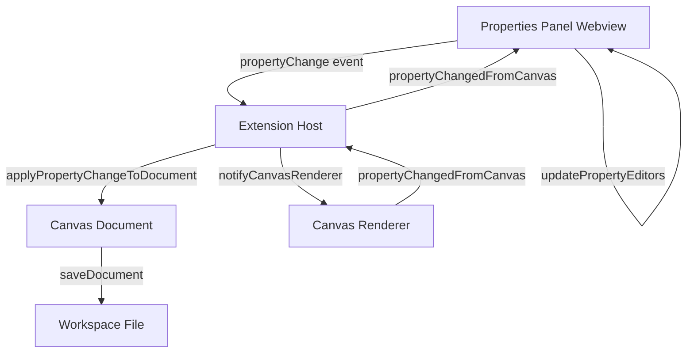
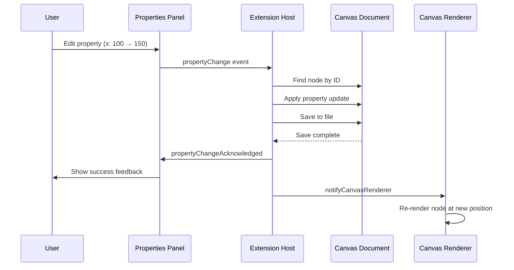

# Feature Plan: Properties Panel Integration

**Author**: @darianrosebrook  
**Date**: 2025-10-03  
**Spec**: DESIGNER-013  
**Risk Tier**: 2

---

## 1. Design Sketch

### Overview

Complete the interactive property editing system for the Designer VS Code extension. This feature enables users to edit node properties through a panel UI, with bidirectional synchronization between the properties panel and canvas renderer. Changes persist to the canvas document file and update the visual representation in real-time.

### Architecture Diagram

### API Changes

| Module | Method/Function | Input | Output | Notes |
|--------|----------------|-------|--------|-------|
| vscode-ext | `handlePropertyChange()` | `PropertyChangeEvent` | `void` | Apply change to document |
| properties-panel-webview | `_applyPropertyChangeToDocument()` | `Document, Event` | `Document` | Immutable update |
| properties-panel-webview | `_notifyCanvasRenderer()` | `PropertyChangeEvent` | `void` | Notify renderer |
| properties-panel-webview | `handleSetDocument()` | `CanvasDocumentType` | `void` | Update panel with doc |
| properties-panel-webview | `handlePropertyChangeAcknowledged()` | `PropertyChangeEvent` | `void` | UI feedback |
| properties-panel-webview | `handlePropertyChangedFromCanvas()` | `PropertyChangeEvent` | `void` | Bidirectional sync |

### Sequence Diagram

---

## 2. Current State Analysis

### Existing Code

The properties panel has partial implementation:

**✅ Already Implemented:**
- `_applyPropertyChangeToDocument()` - Updates document with property change
- `_findNodeById()` - Locates nodes in document tree
- `_applyPropertyToNode()` - Handles nested property updates (e.g., `frame.x`)
- `_saveDocument()` - Persists document to file
- `handlePropertyChange()` - Main event handler (partially complete)

**❌ TODOs to Complete:**

1. **index.ts:262** - `handlePropertyChange()` in extension host
   - Currently just logs and acknowledges
   - Needs to call webview provider's handler

2. **properties-panel-webview.ts:205** - `_notifyCanvasRenderer()`
   - Empty placeholder
   - Needs to post message to canvas webview

3. **properties-panel-webview.ts:682** - `handleSetDocument()`
   - Logs but doesn't update UI
   - Needs to parse document and populate property editors

4. **properties-panel-webview.ts:769** - Get actual node ID
   - Currently hardcoded as `'selected-node'`
   - Needs to use `selection.focusedNodeId` or `selectedNodeIds[0]`

5. **properties-panel-webview.ts:771** - Track old values
   - Currently `null`
   - Needs to read current value before change

6. **properties-panel-webview.ts:786** - `handlePropertyChangeAcknowledged()`
   - Empty stub
   - Needs to update UI with success state

7. **properties-panel-webview.ts:791** - `handlePropertyChangedFromCanvas()`
   - Empty stub
   - Needs to update property editors from canvas events

8. **Integration** - Wire everything together and test

---

## 3. Test Matrix

### Unit Tests

| Test ID | Description | Input | Expected Output | Edge Cases |
|---------|-------------|-------|-----------------|------------|
| U1 | Apply property change | Node + property change event | Updated node | Invalid property key |
| U2 | Find node by ID | Document + node ID | Node or null | Nested nodes, missing ID |
| U3 | Save document | Updated document | File written | Workspace closed, permission denied |
| U4 | Track old values | Node + property key | Current value | Missing property, undefined values |

### Integration Tests

| Test ID | Description | Setup | Action | Assertion |
|---------|-------------|-------|--------|-----------|
| I1 | Full property change flow | Load document, select node | Edit X position | Document saved, value updated |
| I2 | Bidirectional sync | Change property in canvas | Emit event | Panel updates to show new value |
| I3 | Multi-select editing | Select 3 nodes | Edit shared property | All 3 nodes update |
| I4 | Validation failure | Select node | Enter invalid value | Error shown, original value retained |

---

## 4. Implementation Phases

### Phase 1: Core Property Application (2 days)

**Focus**: Complete document update and persistence

**Tasks:**
- [x] Review existing `_applyPropertyChangeToDocument()` implementation
- [ ] Fix `handlePropertyChange()` in index.ts to call webview provider
- [ ] Implement old value tracking in webview property change handler
- [ ] Fix hardcoded node ID to use actual selection
- [ ] Add unit tests for property application
- [ ] Test document save and reload

**Acceptance**: Property changes save to document file correctly

### Phase 2: Canvas Renderer Integration (1 day)

**Focus**: Enable bidirectional sync with canvas

**Tasks:**
- [ ] Implement `_notifyCanvasRenderer()` to post message to canvas webview
- [ ] Implement `handlePropertyChangedFromCanvas()` to update panel
- [ ] Add integration tests for renderer sync
- [ ] Test manual canvas edits update panel

**Acceptance**: Canvas and panel stay in sync

### Phase 3: UI Feedback & Document Context (1 day)

**Focus**: Polish user experience

**Tasks:**
- [ ] Implement `handleSetDocument()` to populate property editors
- [ ] Implement `handlePropertyChangeAcknowledged()` for success feedback
- [ ] Add loading states and error handling
- [ ] Test with real node selection and property editing

**Acceptance**: Users see immediate feedback for all actions

### Phase 4: Testing & Documentation (1 day)

**Focus**: Ensure quality and maintainability

**Tasks:**
- [ ] Write comprehensive unit tests (target 85% coverage)
- [ ] Add integration tests for full workflows
- [ ] Update documentation
- [ ] Create demo video/GIF for README

**Acceptance**: All tests pass, documentation complete

---

## 5. Risks & Mitigations

| Risk | Impact | Probability | Mitigation |
|------|--------|-------------|------------|
| Canvas webview not initialized | High | Medium | Null checks, graceful degradation |
| Concurrent property changes | Medium | Low | Debounce rapid changes, queue updates |
| File save conflicts | Medium | Low | Atomic writes, conflict detection |
| Invalid property values | Low | Medium | Zod validation before save |

---

## 6. Success Criteria

### Functional
- [ ] All 8 TODOs resolved
- [ ] Property changes persist to document
- [ ] Canvas and panel sync bidirectionally
- [ ] Old values tracked for undo/redo

### Non-Functional
- [ ] Property update latency <100ms
- [ ] Test coverage ≥85% (Tier 2 requirement)
- [ ] All acceptance criteria met (A1-A6)
- [ ] Documentation complete

### Quality
- [ ] No regressions in existing tests
- [ ] Code review approved
- [ ] CAWS compliance score >95%

---

## 7. Follow-Up Work

**Not in Scope for This Feature:**
- Undo/redo UI implementation (future: DESIGNER-014)
- Bulk property editing for multiple nodes with different values
- Property validation with custom constraints
- Property animations/transitions

**Technical Debt Created:**
- Document ID → file path mapping is simplistic (assumes ID = filename)
- No conflict resolution for concurrent edits
- Property editors are basic HTML inputs (could be React components)

---

## 8. Questions & Decisions

| Question | Decision | Rationale | Date |
|----------|----------|-----------|------|
| How to handle canvas webview messaging? | Use global extension instance reference | Simplest for MVP, can refactor to event bus later | 2025-10-03 |
| Should we validate property values? | Basic type checking only for now | Complex validation can be added later | 2025-10-03 |
| How to track old values? | Read from current document before change | Simple and reliable, no state management needed | 2025-10-03 |

---

**Last Updated**: 2025-10-03  
**Status**: In Progress

