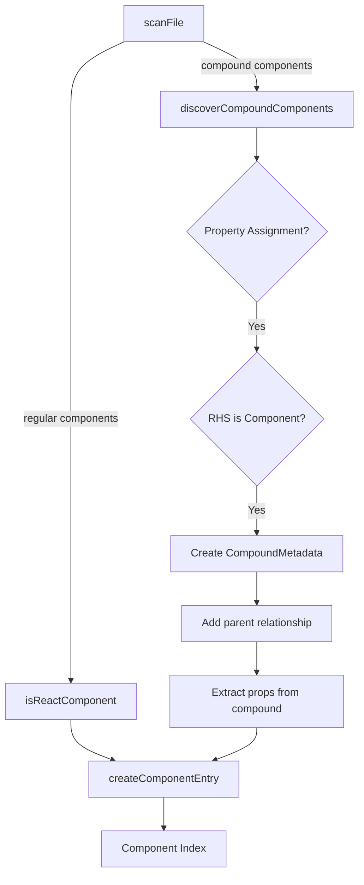
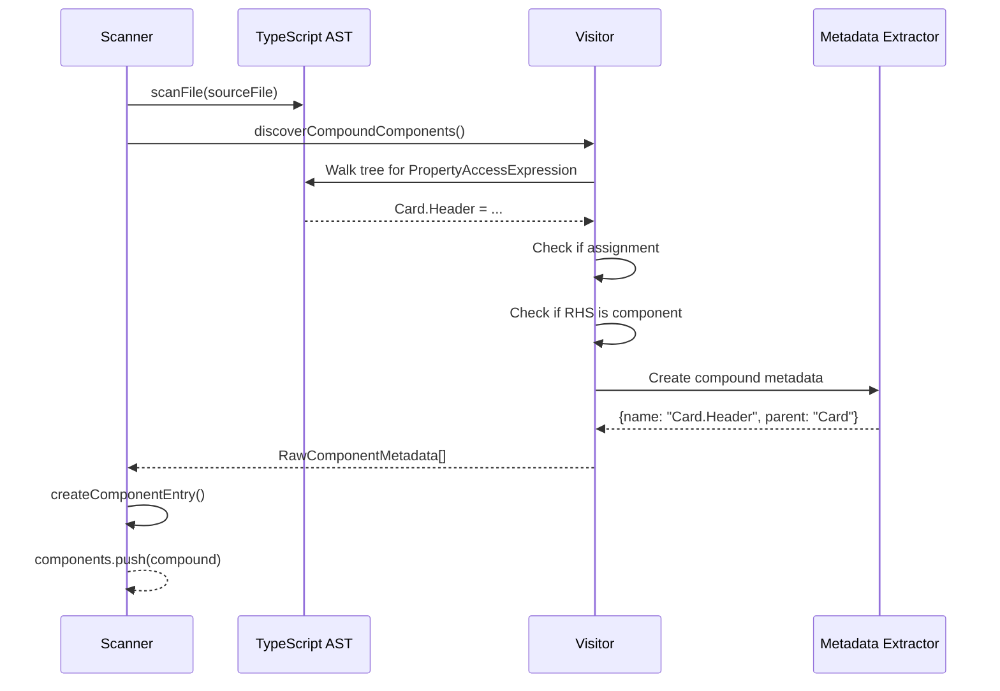

# Feature Plan: Compound Component Detection

**Author**: @darianrosebrook  
**Date**: 2025-10-03  
**Spec**: DESIGNER-014  
**Risk Tier**: 2

---

## 1. Design Sketch

### Overview

Enable the component indexer to detect and catalog compound components (sub-components attached as properties). This pattern is common in component libraries like:
- `Card.Header`, `Card.Body`, `Card.Footer`
- `Menu.Item`, `Menu.Divider`
- `Tabs.Panel`, `Tabs.List`
- `Select.Option`, `Select.OptGroup`

### Compound Component Patterns

**Pattern 1: Direct Assignment**
```typescript
const Card = ({ children }) => <div className="card">{children}</div>;
Card.Header = ({ children }) => <div className="card-header">{children}</div>;
Card.Body = ({ children }) => <div className="card-body">{children}</div>;
```

**Pattern 2: Reference Assignment**
```typescript
const MenuItem = ({ label }) => <li>{label}</li>;
const Menu = ({ children }) => <ul>{children}</ul>;
Menu.Item = MenuItem; // Reference to existing component
```

**Pattern 3: With Props Interface**
```typescript
interface TabPanelProps {
  title: string;
  active?: boolean;
  children: React.ReactNode;
}

const TabPanel: React.FC<TabPanelProps> = ({ title, active, children }) => (
  <div className={active ? 'active' : ''}>{children}</div>
);

Tabs.Panel = TabPanel;
```

### Architecture Diagram



### Sequence Diagram



---

## 2. Current State Analysis

### Existing Code

**scanner.ts (lines 196-200)**: Commented-out integration
```typescript
// TODO: Implement compound component detection
// const compoundComponents = this.discoverCompoundComponents(sourceFile);
// for (const compound of compoundComponents) {
//   components.push(this.createComponentEntry(compound));
// }
```

**scanner.ts (lines 353-417)**: Complete implementation exists!
```typescript
private discoverCompoundComponents(
  sourceFile: ts.SourceFile
): RawComponentMetadata[] {
  const compounds: RawComponentMetadata[] = [];
  
  // Finds patterns like: Component.SubComponent = ...
  // Already handles:
  // - Arrow functions
  // - Function expressions
  // - Identifier references
  // - Filtering out defaultProps
  
  return compounds;
}
```

### What's Already Implemented ✅

1. ✅ AST traversal for property access expressions
2. ✅ Detection of assignment patterns (`Component.SubComponent = ...`)
3. ✅ JSX return type checking for component validation
4. ✅ Filtering of non-component properties (e.g., `defaultProps`)
5. ✅ Metadata generation with parent relationship
6. ✅ Compound naming convention (`Card.Header`)

### What Needs to Be Done

1. **Uncomment the integration** (lines 196-200)
2. **Update types** to support parent-child relationships in schema
3. **Add tests** for various compound component patterns
4. **Fix potential issues**:
   - Props extraction for compound components
   - Export name handling
   - Component ID generation
5. **Documentation** - Add examples and usage guide

---

## 3. Test Matrix

### Unit Tests

| Test ID | Description | Input | Expected Output |
|---------|-------------|-------|-----------------|
| U1 | Detect direct assignment | `Card.Header = () => <div/>` | Compound component detected |
| U2 | Detect reference assignment | `Menu.Item = MenuItem` | Compound component with reference |
| U3 | Extract props from compound | `Card.Body = ({title}) => <div>{title}</div>` | Props extracted correctly |
| U4 | Ignore non-components | `Card.displayName = "Card"` | Property ignored |
| U5 | Handle multiple compounds | `Card.Header`, `Card.Body`, `Card.Footer` | All three detected |

### Integration Tests

| Test ID | Description | Setup | Action | Assertion |
|---------|-------------|-------|--------|-----------|
| I1 | Scan real component library | Load MUI-like component file | Run scanner | All compounds found |
| I2 | Component index generation | Build index with compounds | Save to file | Schema validation passes |
| I3 | Parent-child relationships | Scan compound components | Check metadata | Parent field correctly populated |

### Edge Cases

1. **Nested compounds**: `Table.Row.Cell` (depth > 2)
2. **Circular references**: `A.B = B; B.A = A`
3. **Dynamic properties**: `Card[key] = ...`
4. **TypeScript namespaces**: `namespace Card { export const Header = ... }`

---

## 4. Implementation Phases

### Phase 1: Core Integration (1 day)

**Focus**: Enable compound detection and validate it works

**Tasks:**
- [x] Review existing `discoverCompoundComponents()` implementation
- [ ] Uncomment integration in `scanFile()`
- [ ] Fix any immediate issues (props extraction, IDs)
- [ ] Add basic unit tests
- [ ] Verify scanner doesn't break existing functionality

**Acceptance**: Compound components detected and added to index

### Phase 2: Type System Updates (0.5 days)

**Focus**: Update schema to support compound relationships

**Tasks:**
- [ ] Add `parent` field to `ComponentEntrySchema`
- [ ] Add `isCompound` boolean flag
- [ ] Update `category` to include "compound"
- [ ] Add `compoundChildren` array to parent components
- [ ] Validate schema with test data

**Acceptance**: Component index schema supports compound metadata

### Phase 3: Testing & Edge Cases (0.5 days)

**Focus**: Comprehensive test coverage

**Tasks:**
- [ ] Test all compound patterns (direct, reference, with props)
- [ ] Test edge cases (nested, circular, dynamic)
- [ ] Performance test with large component libraries
- [ ] Integration test with real libraries (MUI, Chakra)

**Acceptance**: 85% test coverage, all edge cases handled

### Phase 4: Documentation (0.5 days)

**Focus**: User-facing documentation

**Tasks:**
- [ ] Update README with compound component support
- [ ] Add examples of detected patterns
- [ ] Document limitations and known issues
- [ ] Create changelog entry

**Acceptance**: Documentation complete and accurate

---

## 5. Schema Changes

### Before (Current)

```typescript
export const ComponentEntrySchema = z.object({
  id: z.string().regex(/^[a-z0-9\-]{10,}$/),
  name: z.string(),
  modulePath: z.string(),
  export: z.string(),
  category: z.string().optional(),
  tags: z.array(z.string()).optional(),
  semanticKeys: z.record(SemanticKeyMappingSchema).optional(),
  props: z.array(ComponentPropSchema),
  variants: z.array(z.record(z.unknown())).optional(),
  examples: z.array(z.string()).optional(),
});
```

### After (Proposed)

```typescript
export const ComponentEntrySchema = z.object({
  id: z.string().regex(/^[a-z0-9\-]{10,}$/),
  name: z.string(),
  modulePath: z.string(),
  export: z.string(),
  category: z.string().optional(),
  tags: z.array(z.string()).optional(),
  semanticKeys: z.record(SemanticKeyMappingSchema).optional(),
  props: z.array(ComponentPropSchema),
  variants: z.array(z.record(z.unknown())).optional(),
  examples: z.array(z.string()).optional(),
  
  // NEW: Compound component support
  parent: z.string().optional(), // Parent component name (e.g., "Card" for "Card.Header")
  isCompound: z.boolean().optional(), // True if this is a compound component
  compoundChildren: z.array(z.string()).optional(), // IDs of child compounds
});
```

---

## 6. Risks & Mitigations

| Risk | Impact | Probability | Mitigation |
|------|--------|-------------|------------|
| False positives (non-components detected) | Medium | Low | Strict JSX return type checking |
| Props extraction fails for compounds | High | Medium | Test with various prop patterns, fallback to empty props |
| Performance degradation | Low | Low | Add performance budget test (<50ms overhead) |
| Breaking schema changes | Medium | Low | Make fields optional, maintain backward compatibility |

---

## 7. Success Criteria

### Functional
- [ ] All compound component patterns detected
- [ ] Parent-child relationships tracked
- [ ] Props extracted from compound components
- [ ] Component index schema valid

### Non-Functional
- [ ] Compound detection adds <10% to scan time
- [ ] Test coverage ≥85%
- [ ] No regressions in existing component detection
- [ ] Documentation complete

### Quality
- [ ] All acceptance criteria met (A1-A4)
- [ ] Edge cases handled gracefully
- [ ] Code review approved
- [ ] CAWS compliance score >95%

---

## 8. Questions & Decisions

| Question | Decision | Rationale | Date |
|----------|----------|-----------|------|
| How to handle nested compounds (A.B.C)? | Support up to depth 2, warn on deeper | Most libraries don't go deeper, reduces complexity | 2025-10-03 |
| Should we extract props for compound components? | Yes, full prop extraction | Consistency with regular components | 2025-10-03 |
| How to generate IDs for compounds? | `compound-${parent}-${child}` | Deterministic, avoids collisions | 2025-10-03 |

---

**Last Updated**: 2025-10-03  
**Status**: In Progress


