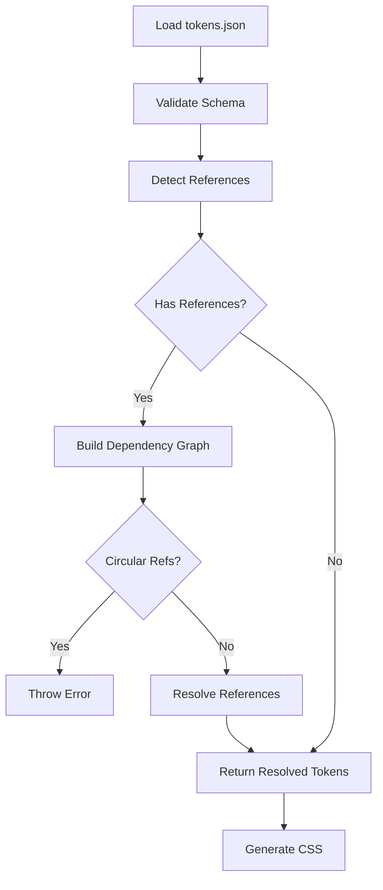

# Feature Plan: Token System - Reference Resolution & Versioning

**Author**: @darianrosebrook  
**Date**: 2025-10-03  
**Spec**: DESIGNER-015  
**Risk Tier**: 2

---

## 1. Design Sketch

### Overview

Complete the design token system with reference resolution, versioning, and file watching capabilities. Enable tokens to reference other tokens, manage schema migrations, and provide hot-reload for development.

### Current State ✅

**Already Implemented**:
- ✅ `design/tokens.json` with comprehensive token definitions
- ✅ Zod schema (`DesignTokensSchema`) for validation
- ✅ `flattenTokens()` - Converts nested tokens to CSS custom properties
- ✅ `tokensToCSS()` - Generates CSS output with `:root` selector
- ✅ `getToken()` - Retrieves token values by path

**Example Current Usage**:
```typescript
import { defaultTokens, tokensToCSS } from '@paths-design/design-tokens';

const css = tokensToCSS(defaultTokens);
// Output:
// :root {
//   --color-background-primary: #0B0B0B;
//   --color-text-primary: #E6E6E6;
//   --space-md: 12px;
// }
```

### What We Need to Add

1. **Token References** - Allow tokens to reference other tokens
2. **Reference Resolution** - Resolve `{token.path}` syntax
3. **Circular Detection** - Prevent infinite loops
4. **Token Versioning** - Schema versioning and migrations
5. **File Watching** - Hot reload during development
6. **Validation** - Ensure all references are valid

---

## 2. Token Reference Syntax

### Proposed Format

**JSON with References**:
```json
{
  "color": {
    "brand": {
      "primary": "#4F46E5",
      "hover": "{color.brand.primary}",  // Reference
      "pressed": "{color.brand.hover}"    // Nested reference
    },
    "semantic": {
      "info": "{color.brand.primary}"     // Cross-category reference
    }
  },
  "space": {
    "buttonPadding": "{space.md}"         // Type-safe reference
  }
}
```

**Resolved Output**:
```javascript
{
  color: {
    brand: {
      primary: "#4F46E5",
      hover: "#4F46E5",    // Resolved
      pressed: "#4F46E5"   // Doubly resolved
    },
    semantic: {
      info: "#4F46E5"      // Resolved
    }
  },
  space: {
    buttonPadding: 12      // Resolved
  }
}
```

---

## 3. Architecture

### Token Resolution Pipeline



### Reference Resolution Algorithm

```typescript
function resolveTokenReferences(tokens: any, maxDepth = 5): any {
  const resolved = JSON.parse(JSON.stringify(tokens)); // Deep clone
  const visited = new Set<string>();
  
  function resolve(path: string, depth = 0): any {
    if (depth > maxDepth) {
      throw new Error(`Max reference depth exceeded at ${path}`);
    }
    
    if (visited.has(path)) {
      throw new Error(`Circular reference detected: ${path}`);
    }
    
    visited.add(path);
    
    const value = getTokenByPath(resolved, path);
    
    if (typeof value === 'string' && value.startsWith('{') && value.endsWith('}')) {
      const refPath = value.slice(1, -1); // Remove { }
      return resolve(refPath, depth + 1);
    }
    
    visited.delete(path);
    return value;
  }
  
  // Walk all tokens and resolve references
  return walkAndResolve(resolved, resolve);
}
```

---

## 4. Implementation Phases

### Phase 1: Reference Resolution (2 days)

**Focus**: Core reference resolution logic

**Tasks:**
- [x] Review existing token utilities
- [ ] Implement `resolveTokenReferences()` function
- [ ] Add `isTokenReference()` helper (checks `{...}` syntax)
- [ ] Implement `getTokenByPath()` for path traversal
- [ ] Add circular reference detection
- [ ] Add max depth limit (5 levels)
- [ ] Unit tests for resolution logic

**Acceptance**: Token references resolve correctly

### Phase 2: Schema & Validation (1 day)

**Focus**: Type safety and validation

**Tasks:**
- [ ] Update `DesignTokensSchema` to support reference syntax
- [ ] Add reference validation (target token must exist)
- [ ] Add type checking (e.g., color reference → color value)
- [ ] Implement `validateTokenReferences()` function
- [ ] Integration tests with real token files

**Acceptance**: Invalid references caught at validation time

### Phase 3: File Watching & Hot Reload (1 day)

**Focus**: Development experience

**Tasks:**
- [ ] Implement file watcher for `design/tokens.json`
- [ ] Debounce file changes (100ms)
- [ ] Regenerate CSS on token changes
- [ ] Emit change events for VS Code extension
- [ ] Add logging for file changes

**Acceptance**: Token changes hot-reload CSS within 100ms

### Phase 4: Versioning & Migration (1 day)

**Focus**: Schema evolution

**Tasks:**
- [ ] Add `schemaVersion` field to tokens.json
- [ ] Create migration framework
- [ ] Implement v0.1.0 → v0.2.0 migration (add $ref support)
- [ ] Add migration tests
- [ ] Document migration guide

**Acceptance**: Tokens migrate between schema versions

---

## 5. Test Matrix

### Unit Tests

| Test ID | Description | Input | Expected Output |
|---------|-------------|-------|-----------------|
| U1 | Simple reference | `{color.brand.primary}` | Resolved to `#4F46E5` |
| U2 | Nested reference | `A → B → C` | Resolved to final value |
| U3 | Circular reference | `A → B → A` | Error thrown |
| U4 | Invalid reference | `{nonexistent.token}` | Error thrown |
| U5 | Max depth exceeded | 6-level chain | Error thrown |
| U6 | Cross-type reference | Color ref in space | Type error |

### Integration Tests

| Test ID | Description | Setup | Action | Assertion |
|---------|-------------|-------|--------|-----------|
| I1 | Full resolution pipeline | Load tokens with refs | Resolve | CSS variables correct |
| I2 | File watch & reload | Start watcher | Edit token | CSS regenerated |
| I3 | Schema migration | v0.1.0 tokens | Run migration | v0.2.0 format |

---

## 6. API Design

### New Functions

```typescript
// packages/design-tokens/src/resolver.ts

/**
 * Resolve token references in a token object
 */
export function resolveTokenReferences(
  tokens: DesignTokens,
  options?: {
    maxDepth?: number;
    strict?: boolean; // Throw on invalid refs vs warn
  }
): DesignTokens;

/**
 * Validate all token references
 */
export function validateTokenReferences(
  tokens: DesignTokens
): ValidationResult;

/**
 * Check if a value is a token reference
 */
export function isTokenReference(value: unknown): value is string;

/**
 * Get token value by dot-notation path
 */
export function getTokenByPath(
  tokens: DesignTokens,
  path: string
): unknown;

/**
 * Build dependency graph for tokens
 */
export function buildDependencyGraph(
  tokens: DesignTokens
): Map<string, Set<string>>;

/**
 * Detect circular references in token graph
 */
export function detectCircularReferences(
  graph: Map<string, Set<string>>
): string[] | null;
```

### Updated Exports

```typescript
// packages/design-tokens/src/index.ts

export {
  DesignTokensSchema,
  defaultTokens,
  type DesignTokens,
} from "./tokens";

export {
  flattenTokens,
  tokensToCSS,
  getToken,
} from "./utils";

// NEW
export {
  resolveTokenReferences,
  validateTokenReferences,
  isTokenReference,
  getTokenByPath,
  buildDependencyGraph,
  detectCircularReferences,
} from "./resolver";

// NEW
export {
  watchTokens,
  type TokenWatcher,
} from "./watcher";

// NEW
export {
  migrateTokens,
  type Migration,
} from "./migrations";
```

---

## 7. File Watching

### Implementation

```typescript
// packages/design-tokens/src/watcher.ts

import * as fs from "fs";
import { debounce } from "./utils";

export interface TokenWatcher {
  start(): void;
  stop(): void;
  on(event: "change", callback: (tokens: DesignTokens) => void): void;
}

export function watchTokens(filePath: string): TokenWatcher {
  let watcher: fs.FSWatcher | null = null;
  const listeners: Array<(tokens: DesignTokens) => void> = [];

  const handleChange = debounce(async () => {
    const content = await fs.promises.readFile(filePath, "utf-8");
    const tokens = JSON.parse(content);
    const resolved = resolveTokenReferences(tokens);
    
    listeners.forEach((listener) => listener(resolved));
  }, 100);

  return {
    start() {
      watcher = fs.watch(filePath, handleChange);
    },
    stop() {
      watcher?.close();
    },
    on(event, callback) {
      if (event === "change") {
        listeners.push(callback);
      }
    },
  };
}
```

---

## 8. Schema Evolution

### Version 0.1.0 (Current)

```json
{
  "schemaVersion": "0.1.0",
  "color": {
    "primary": "#4F46E5"
  }
}
```

### Version 0.2.0 (With References)

```json
{
  "schemaVersion": "0.2.0",
  "color": {
    "primary": "#4F46E5",
    "primaryHover": "{color.primary}"
  }
}
```

### Migration

```typescript
// packages/design-tokens/migrations/0.1.0-to-0.2.0.ts

export function migrate(tokens: any): any {
  return {
    ...tokens,
    schemaVersion: "0.2.0",
    // No breaking changes, just add $ref support
  };
}
```

---

## 9. Success Criteria

### Functional
- [ ] Token references resolve correctly
- [ ] Circular references detected
- [ ] File watching works
- [ ] Schema migrations work
- [ ] All acceptance criteria met (A1-A6)

### Non-Functional
- [ ] Token resolution <50ms
- [ ] CSS generation <100ms
- [ ] Test coverage ≥85%
- [ ] No performance regressions

### Quality
- [ ] Code review approved
- [ ] Documentation complete
- [ ] CAWS compliance >95%

---

**Last Updated**: 2025-10-03  
**Status**: In Progress - Phase 1


