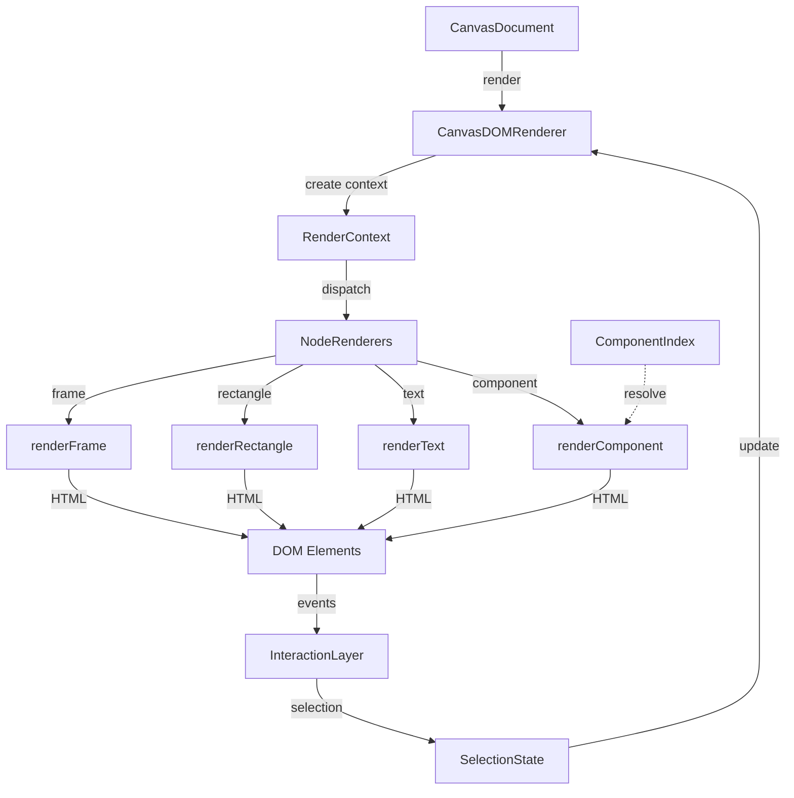
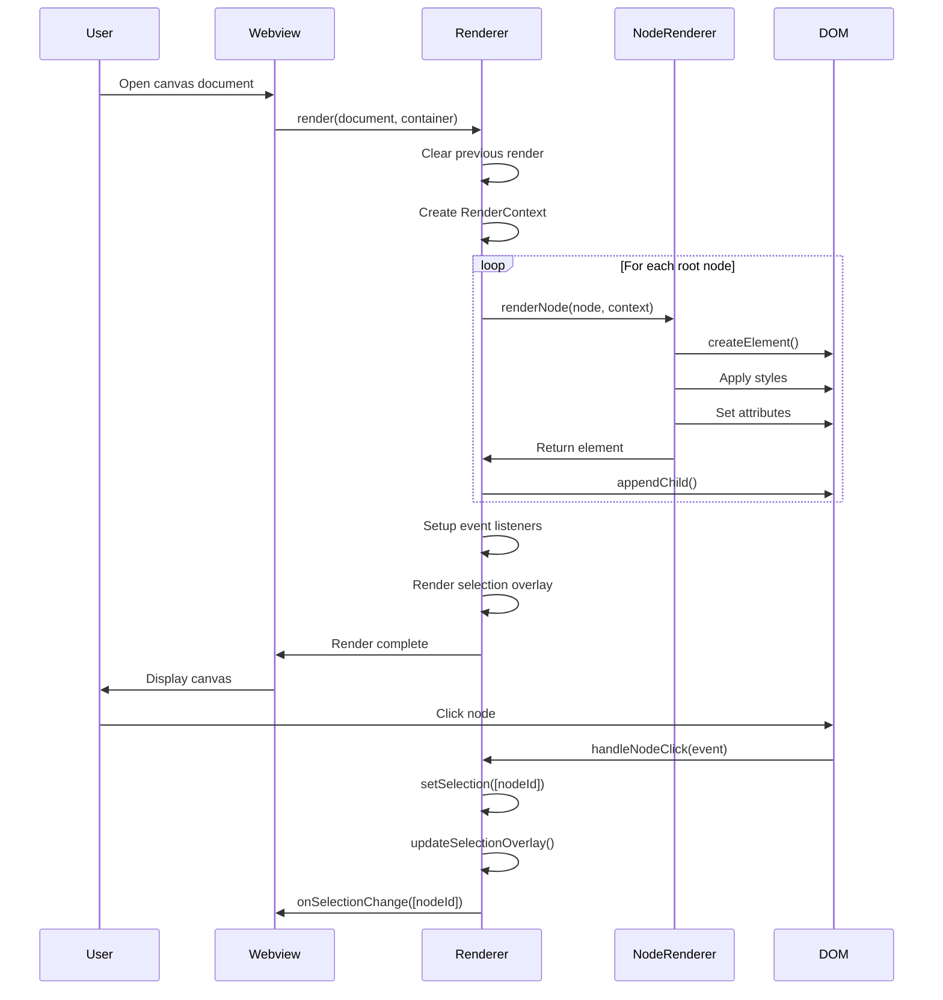

# Feature Plan: Canvas Renderer - DOM Rendering Engine

**Author**: @darianrosebrook  
**Date**: 2025-10-02  
**Spec**: DESIGNER-005  
**Risk Tier**: 2

---

## 1. Design Sketch

### Overview

The Canvas Renderer DOM package provides the visual rendering engine for the Designer tool. It takes a CanvasDocument (scene graph) and renders it to interactive HTML DOM elements within the VS Code webview. This enables users to visually design interfaces while maintaining deterministic code generation.

The renderer must:
- Render all node types (frames, rectangles, text, components) accurately
- Support 60fps performance for documents up to 500 nodes
- Implement dirty tracking to minimize re-renders
- Handle High-DPI displays correctly
- Provide interactive selection and manipulation
- Maintain accessibility standards

### Architecture Diagram



### API Changes

| Module | Method/Function | Input | Output | Notes |
|--------|----------------|-------|--------|-------|
| canvas-renderer-dom | `createCanvasRenderer()` | `RendererOptions` | `CanvasRenderer` | Factory function |
| canvas-renderer-dom | `CanvasRenderer.render()` | `CanvasDocument, HTMLElement` | `void` | Initial render |
| canvas-renderer-dom | `CanvasRenderer.updateNodes()` | `string[], Partial<NodeType>[]` | `void` | Partial updates |
| canvas-renderer-dom | `CanvasRenderer.setSelection()` | `string[]` | `void` | Update selection |
| canvas-renderer-dom | `CanvasRenderer.getRenderedNode()` | `string` | `RenderedNode \| null` | Query rendered node |
| canvas-renderer-dom | `CanvasRenderer.destroy()` | `void` | `void` | Cleanup |

### Sequence Diagram



---

## 2. Test Matrix

### Unit Tests

| Test ID | Description | Input | Expected Output | Edge Cases |
|---------|-------------|-------|-----------------|------------|
| U1 | Renderer initialization | RendererOptions | CanvasRenderer instance | Missing options, invalid options |
| U2 | Basic frame rendering | Frame node | DOM element with correct positioning | Zero dimensions, negative coordinates |
| U3 | Rectangle rendering | Rectangle node | DOM element with fills/strokes | Missing style, transparent fills |
| U4 | Text rendering | Text node | DOM element with text content | Empty text, special characters, multiline |
| U5 | Component resolution | Component instance + index | Resolved component DOM | Missing component, invalid props |
| U6 | Selection handling | Click events | Selection state updated | Multi-select, deselect, rapid clicks |
| U7 | Node positioning | Nested frames | Correct absolute positioning | Deep nesting, rotated nodes |
| U8 | Event listener cleanup | destroy() | All listeners removed | Memory leak testing |
| U9 | High-DPI scaling | 2x devicePixelRatio | Crisp rendering | Various DPI ratios |
| U10 | Dirty tracking | Partial update | Only changed nodes re-rendered | No changes, multiple changes |

### Property-Based Tests

```typescript
// Property: Rendering is idempotent for same input
fc.assert(
  fc.property(
    arbitraryCanvasDoc(),
    (doc) => {
      const container1 = document.createElement('div');
      const container2 = document.createElement('div');
      const renderer1 = createCanvasRenderer();
      const renderer2 = createCanvasRenderer();
      
      renderer1.render(doc, container1);
      renderer2.render(doc, container2);
      
      return container1.innerHTML === container2.innerHTML;
    }
  )
);

// Property: All nodes are rendered
fc.assert(
  fc.property(
    arbitraryCanvasDoc(),
    (doc) => {
      const container = document.createElement('div');
      const renderer = createCanvasRenderer();
      renderer.render(doc, container);
      
      const renderedCount = renderer.getRenderedNodes().length;
      const totalNodes = doc.nodes.length;
      
      return renderedCount === totalNodes;
    }
  )
);

// Property: Selection state is consistent
fc.assert(
  fc.property(
    arbitraryCanvasDoc(),
    fc.array(fc.string()),
    (doc, nodeIds) => {
      const container = document.createElement('div');
      const renderer = createCanvasRenderer();
      renderer.render(doc, container);
      
      const validIds = nodeIds.filter(id => 
        doc.nodes.some(n => n.id === id)
      );
      
      renderer.setSelection(validIds);
      const selectedElements = container.querySelectorAll('.canvas-selected');
      
      return selectedElements.length === validIds.length;
    }
  )
);
```

**Properties to Test:**
- Idempotency: `render(doc)` produces same DOM structure each time
- Completeness: All nodes in document are rendered
- Correctness: Node positions match frame coordinates
- Consistency: Selection state matches DOM classes
- Performance: Render time < 100ms for 500 nodes

### Integration Tests

| Test ID | Description | Setup | Action | Assertion |
|---------|-------------|-------|--------|-----------|
| I1 | Full document render | Load sample canvas.json | Render to container | All nodes visible, positioned correctly |
| I2 | Interactive selection | Render document | Click nodes | Selection updates, callbacks fire |
| I3 | Partial updates | Render document | Update node properties | Only updated nodes re-render |
| I4 | Component resolution | Load component index | Render component instance | Component rendered with correct props |
| I5 | High-DPI display | Set devicePixelRatio=2 | Render document | No blurry rendering |
| I6 | Performance benchmark | 500-node document | Render | Complete in <100ms, 60fps maintained |
| I7 | Memory cleanup | Render and destroy | Check for leaks | No retained references |
| I8 | Event throttling | 500 rapid mouse events | Process events | 60fps maintained |

### E2E/Golden Frame Tests

| Golden Frame | Description | Input | Expected Output |
|--------------|-------------|-------|-----------------|
| simple-frame | Basic frame with children | `tests/golden/simple-frame.canvas.json` | Correct DOM structure snapshot |
| nested-frames | Deeply nested hierarchy | `tests/golden/nested-frames.canvas.json` | Correct positioning at all levels |
| text-styles | Various text styles | `tests/golden/text-styles.canvas.json` | Correct fonts, sizes, colors |
| component-instance | Component with props | `tests/golden/component-instance.canvas.json` | Resolved component rendered |
| selection-state | Multiple selections | `tests/golden/selection-state.canvas.json` | Correct selection overlays |

---

## 3. Data Plan

### Fixtures

```typescript
// Simple document fixture
export const FIXTURE_SIMPLE_DOC: CanvasDocumentType = {
  schemaVersion: '0.1.0',
  id: '01TEST00000000000000000000',
  name: 'Test Document',
  nodes: [
    {
      id: '01TEST00000000000000000001',
      type: 'frame',
      name: 'Root Frame',
      visible: true,
      frame: { x: 0, y: 0, width: 800, height: 600 },
      children: ['01TEST00000000000000000002'],
      layout: { type: 'none' },
      style: { fills: [] }
    },
    {
      id: '01TEST00000000000000000002',
      type: 'rectangle',
      name: 'Rectangle',
      visible: true,
      frame: { x: 100, y: 100, width: 200, height: 150 },
      parentId: '01TEST00000000000000000001',
      style: {
        fills: [{ type: 'solid', color: '#FF0000', opacity: 1 }]
      }
    }
  ]
};

// Complex nested fixture
export const FIXTURE_NESTED_DOC: CanvasDocumentType = {
  // ... 50+ nodes with deep nesting
};

// High-DPI test fixture
export const FIXTURE_HIDPI_DOC: CanvasDocumentType = {
  // ... precise coordinates testing sub-pixel rendering
};
```

### Factories

```typescript
// Factory for creating test frames
export const createFrameNode = (overrides?: Partial<FrameNodeType>): FrameNodeType => ({
  id: ulid(),
  type: 'frame',
  name: 'Frame',
  visible: true,
  frame: { x: 0, y: 0, width: 400, height: 300 },
  children: [],
  layout: { type: 'none' },
  style: { fills: [] },
  ...overrides
});

// Factory for text nodes
export const createTextNode = (overrides?: Partial<TextNodeType>): TextNodeType => ({
  id: ulid(),
  type: 'text',
  name: 'Text',
  visible: true,
  frame: { x: 0, y: 0, width: 200, height: 24 },
  style: {},
  text: 'Test text',
  fontSize: 16,
  fontFamily: 'Inter',
  ...overrides
});

// Factory for component instances
export const createComponentInstance = (
  componentKey: string,
  overrides?: Partial<ComponentInstanceNodeType>
): ComponentInstanceNodeType => ({
  id: ulid(),
  type: 'component',
  name: 'Component Instance',
  visible: true,
  frame: { x: 0, y: 0, width: 100, height: 100 },
  componentKey,
  props: {},
  ...overrides
});
```

### Seed Strategy

- **Deterministic IDs**: Use fixed ULID seeds in tests for reproducibility
- **DOM Environment**: Use JSDOM for unit tests, real DOM for integration tests
- **Component Index**: Mock component index with known test components
- **Performance Baseline**: Maintain golden performance metrics for regression testing

### Anonymized Payloads

```json
{
  "nodeId": "01TEST00000000000000000000",
  "type": "frame",
  "bounds": {
    "x": 100,
    "y": 200,
    "width": 300,
    "height": 400
  }
}
```

---

## 4. Observability Plan

### Logging Strategy

**Log Levels:**
- `ERROR`: Rendering failures, missing node renderers, DOM errors
- `WARN`: Performance budget violations, accessibility warnings, missing components
- `INFO`: Render start/complete, selection changes, major state updates
- `DEBUG`: Individual node rendering, event handling, dirty tracking decisions

**Log Format:**
```typescript
{
  timestamp: '2025-10-02T12:34:56.789Z',
  level: 'INFO',
  category: 'renderer.render',
  status: 'complete',
  metadata: {
    documentId: '01JF2PZV9G2WR5C3W7P0YHNX9D',
    nodeCount: 127,
    renderTimeMs: 42,
    dirtyNodes: 5
  }
}
```

### Metrics

| Metric Name | Type | Description | Labels |
|-------------|------|-------------|--------|
| `renderer_frame_duration_ms` | Histogram | Time to render frame | `{document_id}` |
| `renderer_nodes_drawn_total` | Counter | Total nodes rendered | `{node_type}` |
| `renderer_dirty_nodes_total` | Counter | Nodes marked dirty | `{reason}` |
| `renderer_fps` | Gauge | Current frames per second | `{document_id}` |
| `renderer_memory_mb` | Gauge | Memory usage estimate | `{document_id}` |
| `renderer_event_throttle_rate` | Histogram | Event throttling effectiveness | `{event_type}` |

### Traces

**Spans to Instrument:**
1. `renderer.frame.pipeline`
   - `renderer.clear` (clear previous render)
   - `renderer.layout` (calculate positions)
   - `renderer.paint` (create DOM elements)
   - `renderer.events` (setup event listeners)

2. `renderer.node.render`
   - `renderer.node.create` (createElement)
   - `renderer.node.style` (apply styles)
   - `renderer.node.position` (positioning)
   - `renderer.node.children` (render children)

3. `renderer.hit_test`
   - `renderer.event.capture` (event received)
   - `renderer.hit_test.execute` (find node at point)
   - `renderer.selection.update` (update selection)

### Verification in Tests

```typescript
// Assert on observability in tests
test('render emits performance metrics', () => {
  const metrics = mockMetrics.getAll();
  
  expect(metrics).toContainEqual({
    name: 'renderer_frame_duration_ms',
    value: expect.any(Number),
    labels: { document_id: 'test-doc' }
  });
  
  expect(metrics).toContainEqual({
    name: 'renderer_nodes_drawn_total',
    value: 42,
    labels: { node_type: 'frame' }
  });
});

test('render logs start and complete', () => {
  const logs = mockLogger.getAll();
  
  expect(logs).toContainEqual(
    expect.objectContaining({
      level: 'INFO',
      category: 'renderer.render.start'
    })
  );
  
  expect(logs).toContainEqual(
    expect.objectContaining({
      level: 'INFO',
      category: 'renderer.render.complete'
    })
  );
});
```

---

## 5. Implementation Phases

### Phase 1: Core Renderer Infrastructure (Tier 2)

**Duration**: 1-2 days  
**Focus**: Complete the basic rendering pipeline

**Tasks:**
- [x] Main renderer class (already implemented)
- [x] Type definitions (already implemented)
- [ ] Create individual node renderers (frame, rectangle, text, component)
- [ ] Add index.ts export file
- [ ] Install and configure dependencies
- [ ] Fix TypeScript build errors
- [ ] Basic unit tests for each renderer

**Acceptance**: Package builds successfully, basic rendering works

### Phase 2: Performance & Optimization (Tier 2)

**Duration**: 2-3 days  
**Focus**: Meet performance requirements

**Tasks:**
- [ ] Implement dirty tracking system
- [ ] Add event throttling for rapid events
- [ ] High-DPI display support (devicePixelRatio)
- [ ] Memory profiling and optimization
- [ ] Performance benchmark tests
- [ ] Validate 60fps for 500 nodes
- [ ] Validate <100ms initial render

**Acceptance**: All performance budgets met, benchmarks pass

### Phase 3: Accessibility & Polish (Tier 2)

**Duration**: 1-2 days  
**Focus**: Accessibility and user experience

**Tasks:**
- [ ] Accessibility tree generation
- [ ] Keyboard focus indicators
- [ ] ARIA labels for canvas elements
- [ ] Screen reader support
- [ ] Visual polish (selection outlines, handles)
- [ ] Error handling and recovery
- [ ] Accessibility tests

**Acceptance**: A11y audit passes, screen reader compatible

### Phase 4: Testing & Documentation (Tier 2)

**Duration**: 2-3 days  
**Focus**: Comprehensive test coverage and docs

**Tasks:**
- [ ] Unit tests for all renderers (target 80% coverage)
- [ ] Integration tests with canvas-engine
- [ ] Property-based tests for invariants
- [ ] Golden frame tests
- [ ] Performance regression tests
- [ ] API documentation
- [ ] Usage examples
- [ ] Update main README

**Acceptance**: 80% coverage, 50% mutation score, docs complete

---

## 6. Risks & Mitigations

| Risk | Impact | Probability | Mitigation |
|------|--------|-------------|------------|
| Performance degradation with large docs | High | Medium | Implement virtual scrolling, dirty tracking, profiling |
| High-DPI rendering issues | Medium | Medium | Test on multiple displays, devicePixelRatio handling |
| Memory leaks from unreleased listeners | High | Low | Comprehensive cleanup in destroy(), memory profiling |
| Accessibility gaps | Medium | Medium | A11y audit early, test with screen readers |
| Browser compatibility issues | Low | Low | Target modern browsers, document requirements |
| Component resolution failures | Medium | Medium | Graceful fallbacks, clear error messages |

---

## 7. Dependencies

### Upstream Dependencies
- ✅ canvas-schema (complete)
- ✅ canvas-engine (complete)
- ✅ component-indexer (complete)

### Downstream Impact
- vscode-ext: Will use renderer for webview display
- Future visual editing features will build on renderer
- Testing tools may need renderer for visual validation

---

## 8. Success Criteria

### Functional
- [ ] All node types render correctly (frame, rectangle, text, component)
- [ ] Interactive selection works (single and multi-select)
- [ ] Nested frames calculate positions correctly
- [ ] Component instances resolve and render
- [ ] Event handling works (click, keyboard)
- [ ] Cleanup properly releases resources

### Non-Functional
- [ ] Render 500 nodes in <100ms
- [ ] Maintain 60fps during interaction
- [ ] Dirty tracking reduces re-renders by 90%
- [ ] Memory usage <50MB for 500-node document
- [ ] High-DPI displays render crisply
- [ ] Event throttling maintains 60fps with rapid events

### Quality
- [ ] 80% branch coverage (Tier 2 requirement)
- [ ] 50% mutation score (Tier 2 requirement)
- [ ] All acceptance criteria pass
- [ ] Accessibility audit passes (WCAG 2.1 AA)
- [ ] No memory leaks detected
- [ ] No regressions in existing packages

---

## 9. Follow-Up Work

**Not in Scope for This Feature:**
- Visual editing controls (move, resize, rotate)
- Layout algorithm implementations (flexbox, grid)
- Animation and transitions
- Canvas/WebGL rendering (this is DOM-based)
- Undo/redo integration
- Collaborative cursors

**Technical Debt Created:**
- Renderer only supports DOM output (Canvas2D/WebGL could come later)
- No virtual scrolling yet (may need for very large documents)
- Limited component prop editing UI
- Basic accessibility (could be enhanced)

---

## 10. Questions & Decisions

| Question | Decision | Rationale | Date |
|----------|----------|-----------|------|
| DOM vs Canvas2D rendering? | DOM | Better accessibility, easier debugging, sufficient performance | 2025-10-02 |
| How to handle High-DPI displays? | devicePixelRatio scaling | Standard approach, proven effective | 2025-10-02 |
| Dirty tracking granularity? | Node-level | Balance between performance and complexity | 2025-10-02 |
| Event throttling strategy? | requestAnimationFrame | Native browser optimization | 2025-10-02 |
| Component resolution failure handling? | Render placeholder with error | Graceful degradation, clear feedback | 2025-10-02 |
| Selection model? | Array of node IDs | Simple, flexible, matches VS Code patterns | 2025-10-02 |

---

**Last Updated**: 2025-10-02  
**Status**: In Progress  
**Current Phase**: Phase 1 - Core Renderer Infrastructure

