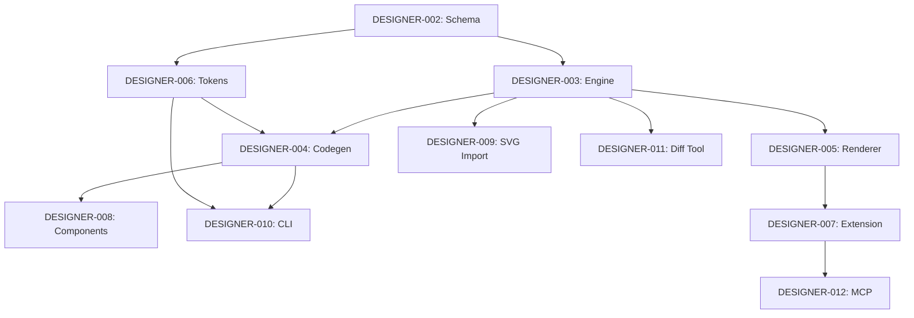

# Designer Implementation Tracking

**Author**: @darianrosebrook  
**Last Updated**: October 2, 2025  
**Status**: Pre-Implementation - Specifications Phase

---

## Overview

This document tracks the implementation of all Designer features through their complete lifecycle: specification → research → implementation → testing → release.

---

## Feature Matrix

### Legend

**Status:**
- 📝 Spec - Working spec written
- 🔬 Research - Research phase
- 🚧 In Progress - Implementation ongoing
- ✅ Complete - Fully implemented and tested
- 🔄 Iteration - Improvements/refinements
- ⏸️ Paused - Temporarily on hold
- ❌ Cancelled - Will not implement

**Priority:**
- 🔴 P0 - Blocking all other work
- 🟠 P1 - Critical for v0.1
- 🟡 P2 - Important for v0.2
- 🔵 P3 - Nice-to-have for future

---

## Core Features Roadmap

### Tier 1 - Critical Path (Foundation)

| ID | Feature | Spec | Status | Priority | Owner | Target | Dependencies |
|----|---------|------|--------|----------|-------|--------|--------------|
| DESIGNER-002 | Canvas Schema & Validation | [spec](../../.caws/specs/DESIGNER-002-canvas-schema.yaml) | 📝 Spec | 🔴 P0 | - | Week 1-2 | - |
| DESIGNER-003 | Canvas Engine (Scene Graph) | [spec](../../.caws/specs/DESIGNER-003-canvas-engine.yaml) | 📝 Spec | 🔴 P0 | - | Week 2-3 | DESIGNER-002 |
| DESIGNER-004 | Deterministic Code Generation | [spec](../../.caws/specs/DESIGNER-004-codegen-react.yaml) | 📝 Spec | 🔴 P0 | - | Week 3-4 | DESIGNER-002, DESIGNER-003 |

### Tier 2 - Core Features (User Experience)

| ID | Feature | Spec | Status | Priority | Owner | Target | Dependencies |
|----|---------|------|--------|----------|-------|--------|--------------|
| DESIGNER-005 | Canvas Renderer (DOM) | [spec](../../.caws/specs/DESIGNER-005-canvas-renderer.yaml) | 📝 Spec | 🟠 P1 | - | Week 3-4 | DESIGNER-003 |
| DESIGNER-006 | Token System | [spec](../../.caws/specs/DESIGNER-006-tokens.yaml) | 📝 Spec | 🟠 P1 | - | Week 4-5 | DESIGNER-002 |
| DESIGNER-007 | VS Code Extension | [spec](../../.caws/specs/DESIGNER-007-vscode-ext.yaml) | 📝 Spec | 🟠 P1 | - | Week 4-6 | DESIGNER-005 |
| DESIGNER-008 | Component Discovery | [spec](../../.caws/specs/DESIGNER-008-component-discovery.yaml) | 📝 Spec | 🟡 P2 | - | Week 6-7 | DESIGNER-004 |
| DESIGNER-009 | SVG Import | [spec](../../.caws/specs/DESIGNER-009-svg-import.yaml) | 📝 Spec | 🟡 P2 | - | Week 7-8 | DESIGNER-003 |

### Tier 3 - Quality of Life (Developer Experience)

| ID | Feature | Spec | Status | Priority | Owner | Target | Dependencies |
|----|---------|------|--------|----------|-------|--------|--------------|
| DESIGNER-010 | CLI Tools | [spec](../../.caws/specs/DESIGNER-010-cli-tools.yaml) | 📝 Spec | 🟡 P2 | - | Week 5-6 | DESIGNER-004, DESIGNER-006 |
| DESIGNER-011 | Semantic Diff Tool | [spec](../../.caws/specs/DESIGNER-011-diff-tool.yaml) | 📝 Spec | 🔵 P3 | - | Week 8-9 | DESIGNER-003 |
| DESIGNER-012 | Cursor MCP Integration | [spec](../../.caws/specs/DESIGNER-012-mcp-adapter.yaml) | 📝 Spec | 🔵 P3 | - | Week 10+ | DESIGNER-007 |

---

## Implementation Checklist

### Phase 1: Foundation (Week 1-4) 🔴 Critical

**Goal**: Establish core data model and deterministic code generation

#### DESIGNER-002: Canvas Schema & Validation
- [ ] Define JSON Schema for canvas documents
- [ ] Create Zod type definitions
- [ ] Implement schema validation with Ajv
- [ ] Create ULID generator for stable IDs
- [ ] Implement canonical JSON serializer
- [ ] Write property-based tests for schema
- [ ] Document schema in `docs/data-model.md`
- [ ] **Exit**: All canvas documents validate against schema

#### DESIGNER-003: Canvas Engine (Scene Graph)
- [ ] Design immutable node data structures
- [ ] Implement node CRUD operations
- [ ] Build tree traversal algorithms
- [ ] Create node finder (by ID, by type, by name)
- [ ] Implement JSON Patch support
- [ ] Add hit testing (basic rectangle collision)
- [ ] Write property-based tests for operations
- [ ] **Exit**: Can manipulate 1000-node documents performantly

#### DESIGNER-004: Deterministic Code Generation
- [ ] Research: Resolve RQ-001, RQ-002, RQ-003
- [ ] Implement deterministic clock injection
- [ ] Create canonical string sorter
- [ ] Build React component emitter
- [ ] Build CSS Module emitter
- [ ] Implement token reference resolver
- [ ] Create golden frame test suite
- [ ] Write determinism validation tests
- [ ] **Exit**: Same input produces identical SHA-256 hash

---

### Phase 2: Rendering & Interaction (Week 3-6) 🟠 Critical

**Goal**: Enable visual design and editing in VS Code

#### DESIGNER-005: Canvas Renderer (DOM)
- [ ] Research: Resolve RQ-016, RQ-017
- [ ] Design rendering architecture (Canvas 2D)
- [ ] Implement frame rendering
- [ ] Implement text rendering
- [ ] Add basic styling support
- [ ] Implement dirty tracking
- [ ] Add performance monitoring
- [ ] Write rendering tests
- [ ] **Exit**: Can render 500 nodes at 60fps

#### DESIGNER-006: Token System
- [ ] Research: Resolve RQ-013, RQ-014, RQ-015
- [ ] Define token schema
- [ ] Implement token parser
- [ ] Build CSS variable emitter
- [ ] Create token reference resolver
- [ ] Implement file watcher
- [ ] Add token validation
- [ ] Write round-trip tests
- [ ] **Exit**: Token changes reflect to CSS in <16ms

#### DESIGNER-007: VS Code Extension
- [ ] Research: Resolve RQ-007, RQ-008, RQ-009
- [ ] Design secure message protocol
- [ ] Implement extension activation
- [ ] Create webview host
- [ ] Build message validation layer
- [ ] Implement file operations
- [ ] Add path validation
- [ ] Write security tests
- [ ] **Exit**: Extension loads securely and renders canvas

---

### Phase 3: Advanced Features (Week 6-8) 🟡 Important

**Goal**: Enable component reuse and asset import

#### DESIGNER-008: Component Discovery
- [ ] Research: Resolve RQ-010, RQ-011, RQ-012
- [ ] Evaluate react-docgen-typescript
- [ ] Build component scanner
- [ ] Implement prop extraction
- [ ] Create component index format
- [ ] Build index generator
- [ ] Add file watcher for components
- [ ] Write discovery tests
- [ ] **Exit**: Can discover and index 100 components

#### DESIGNER-009: SVG Import
- [ ] Research: Resolve RQ-019, RQ-020, RQ-021
- [ ] Define SVG feature support matrix
- [ ] Build SVG parser
- [ ] Implement path converter
- [ ] Create token matcher
- [ ] Add import validation
- [ ] Write conversion tests
- [ ] **Exit**: Can import common SVG files

#### DESIGNER-010: CLI Tools
- [ ] Create CLI package structure
- [ ] Implement `generate` command
- [ ] Implement `watch:tokens` command
- [ ] Add `validate` command
- [ ] Create `diff` command (basic)
- [ ] Write CLI tests
- [ ] Document CLI usage
- [ ] **Exit**: All CLI commands work end-to-end

---

### Phase 4: Polish & Documentation (Week 8-10) 🔵 Nice-to-have

**Goal**: Production-ready tooling and collaboration features

#### DESIGNER-011: Semantic Diff Tool
- [ ] Research merge conflict resolution
- [ ] Build object-level diff algorithm
- [ ] Create visual diff generator
- [ ] Implement conflict detector
- [ ] Add PR comment integration
- [ ] Write diff tests
- [ ] **Exit**: Can show meaningful diffs in PRs

#### DESIGNER-012: Cursor MCP Integration
- [ ] Research: Resolve RQ-025, RQ-026, RQ-027
- [ ] Study Cursor MCP protocol
- [ ] Build MCP server
- [ ] Implement stdio transport
- [ ] Add security validation
- [ ] Write MCP tests
- [ ] **Exit**: Can use Designer from Cursor

---

## Feature Dependencies Graph



---

## Quality Gates by Feature

### Tier 1 Requirements

| Feature | Branch Coverage | Mutation Score | Contract Tests | Property Tests | Golden Frames |
|---------|----------------|----------------|----------------|----------------|---------------|
| DESIGNER-002 | ≥90% | ≥70% | ✅ Required | ✅ Required | N/A |
| DESIGNER-003 | ≥90% | ≥70% | ✅ Required | ✅ Required | N/A |
| DESIGNER-004 | ≥90% | ≥70% | ✅ Required | ✅ Required | ✅ Required |

### Tier 2 Requirements

| Feature | Branch Coverage | Mutation Score | Contract Tests | Integration Tests | A11y Tests |
|---------|----------------|----------------|----------------|-------------------|------------|
| DESIGNER-005 | ≥80% | ≥50% | ✅ Required | ✅ Required | ✅ Required |
| DESIGNER-006 | ≥80% | ≥50% | ✅ Required | ✅ Required | N/A |
| DESIGNER-007 | ≥80% | ≥50% | ✅ Required | ✅ Required | ✅ Required |
| DESIGNER-008 | ≥80% | ≥50% | ✅ Required | ✅ Required | N/A |
| DESIGNER-009 | ≥80% | ≥50% | N/A | ✅ Required | N/A |

### Tier 3 Requirements

| Feature | Branch Coverage | Mutation Score | Smoke Tests |
|---------|----------------|----------------|-------------|
| DESIGNER-010 | ≥70% | ≥30% | ✅ Required |
| DESIGNER-011 | ≥70% | ≥30% | ✅ Required |
| DESIGNER-012 | ≥70% | ≥30% | ✅ Required |

---

## Weekly Progress Tracking

### Week 1: Foundation Setup

**Focus**: Schema & Engine foundation

- [ ] DESIGNER-002: Schema implemented
- [ ] DESIGNER-003: Engine basics working
- [ ] Tests passing for core operations
- [ ] Documentation updated

**Blockers**: _None yet_

---

### Week 2: Determinism Research

**Focus**: Resolve P0 research questions

- [ ] RQ-001: Clock injection decided
- [ ] RQ-002: Sorting algorithm chosen
- [ ] RQ-003: Precision policy set
- [ ] POC validates approach

**Blockers**: _TBD_

---

### Week 3: Code Generation

**Focus**: Deterministic codegen working

- [ ] DESIGNER-004: Basic codegen works
- [ ] Golden frame tests created
- [ ] Determinism verified
- [ ] DESIGNER-005: Renderer started

**Blockers**: _TBD_

---

### Week 4: Extension & Tokens

**Focus**: VS Code integration

- [ ] DESIGNER-006: Tokens working
- [ ] DESIGNER-007: Extension renders canvas
- [ ] Security validated
- [ ] DESIGNER-005: Renderer complete

**Blockers**: _TBD_

---

## Release Criteria

### v0.1 Alpha (Week 6)

**Scope**: Foundation + basic editing

**Required Features:**
- ✅ DESIGNER-002: Canvas Schema
- ✅ DESIGNER-003: Canvas Engine  
- ✅ DESIGNER-004: Deterministic Codegen
- ✅ DESIGNER-005: Canvas Renderer
- ✅ DESIGNER-006: Token System
- ✅ DESIGNER-007: VS Code Extension (basic)

**Quality Requirements:**
- All Tier 1 tests passing (90% coverage, 70% mutation)
- All Tier 2 tests passing (80% coverage, 50% mutation)
- Security audit complete
- Accessibility audit passing
- Documentation complete

**Exit Criteria:**
- Can load/edit/save canvas documents
- Can generate React components
- Can use design tokens
- Extension stable for daily use

---

### v0.2 Beta (Week 10)

**Scope**: Component library + advanced features

**Required Features:**
- ✅ All v0.1 features stable
- ✅ DESIGNER-008: Component Discovery
- ✅ DESIGNER-009: SVG Import
- ✅ DESIGNER-010: CLI Tools

**Quality Requirements:**
- All features meet tier requirements
- Performance benchmarks met
- User testing feedback addressed

**Exit Criteria:**
- Can discover and use components
- Can import SVG assets
- CLI tools fully functional
- Ready for broader testing

---

### v1.0 Stable (Week 14+)

**Scope**: Production-ready with collaboration

**Required Features:**
- ✅ All v0.2 features polished
- ✅ DESIGNER-011: Semantic Diff Tool
- ✅ DESIGNER-012: Cursor MCP (optional)
- Performance optimizations
- Polish and bug fixes

**Quality Requirements:**
- All tests passing consistently
- No critical bugs
- Performance targets met
- Documentation complete

**Exit Criteria:**
- Used in production by team
- Stable for external users
- Support and maintenance plan

---

## Risk Register

| Risk | Impact | Probability | Mitigation | Status |
|------|--------|-------------|------------|--------|
| Determinism not achievable | Critical | Medium | POC before implementation | 🔬 Research |
| Extension security issues | Critical | Low | Security audit + validation | 📝 Planned |
| Performance below target | High | Medium | Profiling + optimization | 📝 Planned |
| Merge conflicts unsolvable | High | Medium | Research + diff tool | 🔬 Research |
| Component discovery unreliable | Medium | Low | Multiple tools evaluation | 📝 Planned |

---

## Communication

### Daily Updates

Post in project channel:
- What was completed today
- What's planned for tomorrow
- Any blockers

### Weekly Reviews

Review this document and update:
- Feature statuses
- Blockers and resolutions
- Risk assessment
- Next week's priorities

### Monthly Retrospectives

Evaluate:
- What's working well
- What needs improvement
- Process adjustments
- Tool/resource needs

---

## Resources

### Documentation
- **Working Specs**: `.caws/specs/DESIGNER-*.yaml`
- **Research**: `docs/research/`
- **Architecture**: `docs/overview.md`, `docs/data-model.md`

### Tools
- **Validation**: `node apps/tools/caws/validate.js`
- **Provenance**: `node apps/tools/caws/provenance.js`
- **Gates**: `node apps/tools/caws/gates.js`

### Templates
- **Feature Spec**: `.caws/templates/feature.plan.md`
- **Test Plan**: `.caws/templates/test-plan.md`
- **PR Template**: `.caws/templates/pr.md`

---

## Quick Commands

```bash
# Validate all specs
for spec in .caws/specs/*.yaml; do
  node apps/tools/caws/validate.js "$spec"
done

# Check feature status
cat docs/implementation/README.md | grep "^| DESIGNER-"

# Run verification
npm run verify

# Generate provenance
npm run caws:prove
```

---

**Last Updated**: October 2, 2025  
**Next Review**: Weekly  
**Maintainer**: @darianrosebrook

