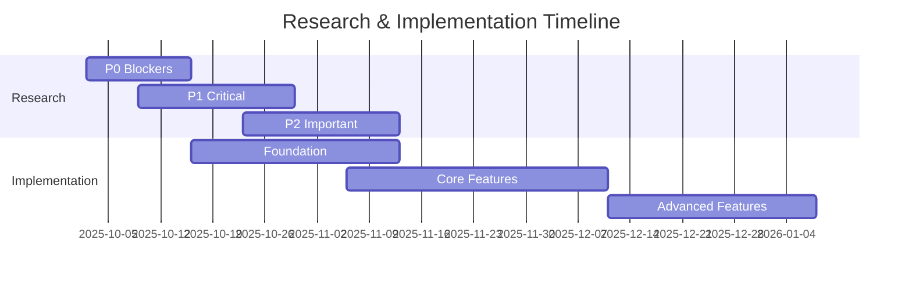

# Research Phase Summary

**Project**: Designer - Design-in-IDE Tool  
**Date**: October 2, 2025  
**Phase**: Pre-Implementation Research

---

## Quick Stats

- **Total Research Questions**: 30
- **P0 Blockers**: 5 (Must resolve before implementation)
- **P1 Critical**: 9 (Must resolve before feature completion)
- **P2 Important**: 10 (Resolve during implementation)
- **P3 Nice-to-Have**: 6 (Can defer to future)

---

## Critical Path

### Must Resolve Before Any Code (Week 1-2)

1. **Deterministic Code Generation** (3 RQs)
   - How do we guarantee identical output?
   - What patterns ensure reproducibility?
   - How do we test determinism?

2. **Merge Conflict Resolution** (2 RQs)
   - How do we detect design file conflicts?
   - What's the resolution algorithm?
   - Can we leverage CRDT?

**Impact**: These block all development. Without determinism, we can't trust generated code. Without merge strategy, collaboration is impossible.

---

## High-Priority Areas

### Security & Safety (Week 3)

- Webview message protocol validation
- Path validation and sandboxing
- Resource limits and quotas

**Impact**: Security vulnerabilities could compromise user systems. Must be right from day one.

### Accessibility (Week 2-4)

- Accessible canvas interaction
- Contrast computation
- Generated code accessibility

**Impact**: Accessibility is a core requirement, not an afterthought. WCAG 2.1 AA compliance mandatory.

### Component Discovery (Week 5-6)

- Component discovery mechanism
- Prop extraction from TypeScript
- Component indexing format

**Impact**: Enables the component library feature. Without this, designers can't reuse components.

---

## Medium-Priority Areas

### Token System (Week 4-5)

- Token transformation rules
- Reference resolution
- Versioning and migration

**Impact**: Core to design system workflow but not blocking initial implementation.

### Performance (Week 3-4)

- Canvas rendering architecture
- Hit testing optimization
- Document size limits

**Impact**: Affects user experience but can be iteratively improved.

### SVG Import (Week 6-7)

- SVG feature support scope
- Conversion algorithm
- Token matching heuristics

**Impact**: Nice-to-have feature that can wait until core is solid.

---

## Lower-Priority Areas

### Testing Infrastructure (Ongoing)

- Property-based testing
- Golden frame workflow
- Visual regression

**Impact**: Important but can be built alongside features.

### Cursor MCP (Week 8+)

- MCP protocol research
- Server architecture
- Security model

**Impact**: Optional integration, not critical for v0.1.

---

## Research Approach

### Phase 1: Discovery (Current)

**Goal**: Identify all gaps and unknowns

- ✅ Analyzed existing documentation
- ✅ Identified 30 research questions
- ✅ Prioritized by impact and urgency
- ⏳ Created tracking system

### Phase 2: Experiments (Week 1-2)

**Goal**: Validate approaches through POCs

- Build proof-of-concepts for P0 items
- Run experiments for each RQ
- Document findings and decisions
- Choose implementation paths

### Phase 3: Documentation (Week 2-3)

**Goal**: Create implementation guides

- Write ADRs for key decisions
- Document patterns and conventions
- Create developer guides
- Update working specs

### Phase 4: Implementation (Week 3+)

**Goal**: Build with confidence

- Reference decisions and patterns
- Iterate based on learnings
- Continue research for P2/P3 items
- Maintain documentation

---

## Key Insights

### What We're Confident About

1. **Architecture**: Monorepo structure is well-defined
2. **Risk Tiering**: Clear quality standards per tier
3. **Workflow**: CAWS provides solid development process
4. **Vision**: Goal document comprehensive and clear

### What Needs Research

1. **Determinism**: Specific patterns and testing
2. **Merge Strategy**: Algorithm details and conflict UI
3. **Security**: Validation and sandboxing specifics
4. **Component Discovery**: Tooling and indexing
5. **Performance**: Optimization strategy and limits

### What Can Wait

1. **Cursor MCP**: Not needed for v0.1
2. **Visual Regression**: Can add later
3. **Advanced SVG**: Start with basics
4. **CRDT**: Optional for multi-user

---

## Risk Assessment

### High Risk 🔴

**Without resolution, project fails or has major defects**

- Deterministic codegen not working
- Security vulnerabilities in extension
- Accessibility non-compliance
- Merge conflicts corrupting files

**Mitigation**: Prioritize P0 and P1 research, build POCs before committing to implementation.

### Medium Risk 🟡

**Without resolution, features incomplete or poor UX**

- Performance issues with large documents
- Token drift between design and code
- Component discovery unreliable
- SVG import lossy or broken

**Mitigation**: Research during implementation, iterate based on user feedback.

### Low Risk 🔵

**Nice-to-have features or optimizations**

- Cursor MCP integration missing
- Visual regression tests absent
- Advanced testing infrastructure incomplete

**Mitigation**: Defer to future iterations, focus on core value first.

---

## Success Criteria

### Research Phase Complete When:

- [ ] All P0 blockers resolved (RQ-001 through RQ-005)
- [ ] P1 critical items have clear path forward
- [ ] POCs validate key technical approaches
- [ ] ADRs document major decisions
- [ ] Team confident in implementation plan

### Ready for Implementation When:

- [ ] Deterministic codegen POC working
- [ ] Merge strategy documented and tested
- [ ] Security model validated
- [ ] Accessibility approach tested
- [ ] Component discovery prototyped

---

## Timeline

---

## Next Actions

### This Week (Week 1)

1. **Assign owners** to P0 research questions
2. **Schedule research sprint** planning meeting
3. **Create experiment plans** for RQ-001, RQ-002, RQ-003
4. **Begin POC** for deterministic codegen
5. **Document** conflict taxonomy

### Next Week (Week 2)

6. **Complete P0 research** and document decisions
7. **Begin P1 security** research
8. **Prototype accessible** canvas
9. **Update working specs** with findings
10. **Plan implementation** based on research

---

## Resources

- **[Full Gap Analysis](./GAPS_AND_UNKNOWNS.md)** - Detailed research questions
- **[Research Tracker](./RESEARCH_TRACKER.md)** - Status and priorities
- **[Working Spec](../../.caws/working-spec.yaml)** - Project requirements
- **[AGENTS.md](../../AGENTS.md)** - Development workflow

---

**Status**: ⚪ Research Phase - Ready to Begin  
**Next Review**: Weekly throughout research phase
